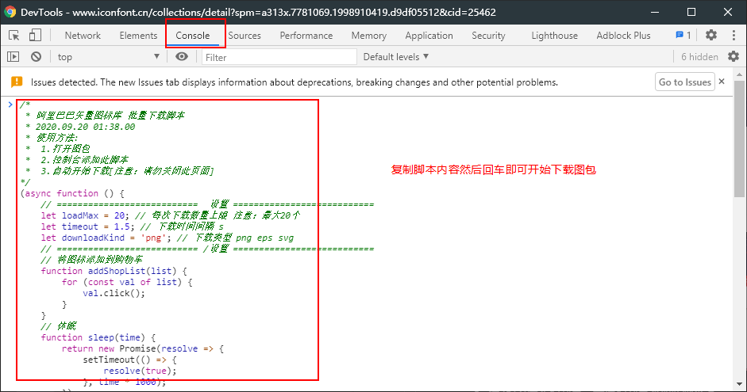
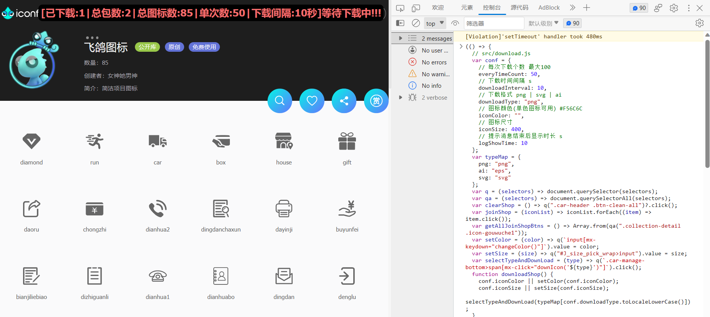

# Alibaba-Iconfont-downloads

**`功能:` 阿里巴巴矢量图标库 `图标库` 批量下载脚本**

**`图库地址:` [阿里巴巴矢量图标库](https://www.iconfont.cn/collections/index)**

## 📖 使用方法

### 方式一: 添加为浏览器标签的方式使用(长久,不方便改参数,推荐)

1. 复制 [dist/download.js](./dist/download.js)的内容到标签的 **URL** 中,名称随意


2. 使用时转到 **图标详细界面** 点击标签即可执行


### 方式二: F12控制台执行的方式使用(临时,方便修改参数)

1. 到 **图标详细界面** 点击按键 [F12]打开控制台

2. 拷贝控制台代码回车执行 [dist/download.console.js](./dist/download.console.js) ps:可以修改参数



## 📦 构建 打包

1. 安装依赖
    ```shell
    npm i
    ```
2. 修改代码/配置 [src/download.js](./src/download.js)

3. 打包
    ```shell
    npm run build
    ```

## 😄 最后

其他库有时间再添加,玩的开心!!!