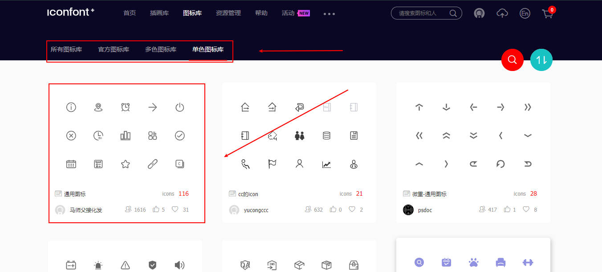
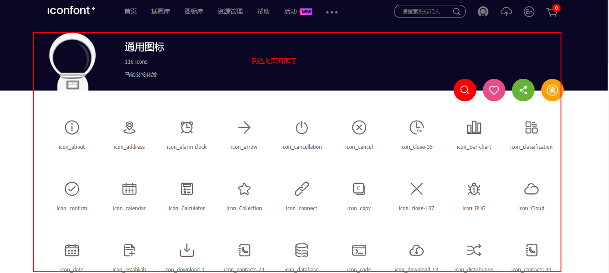
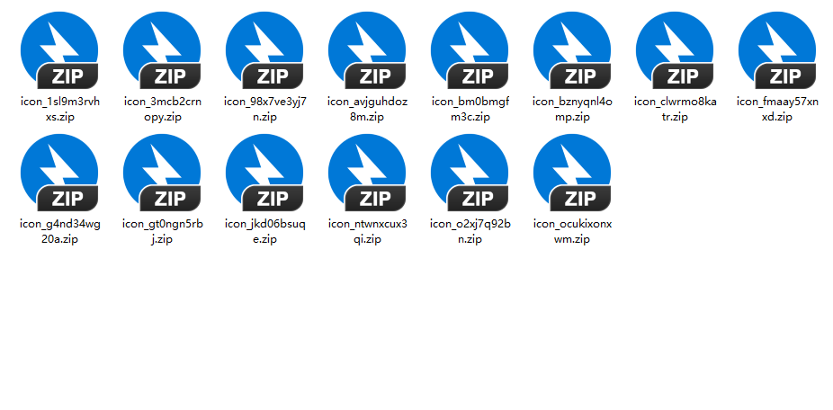
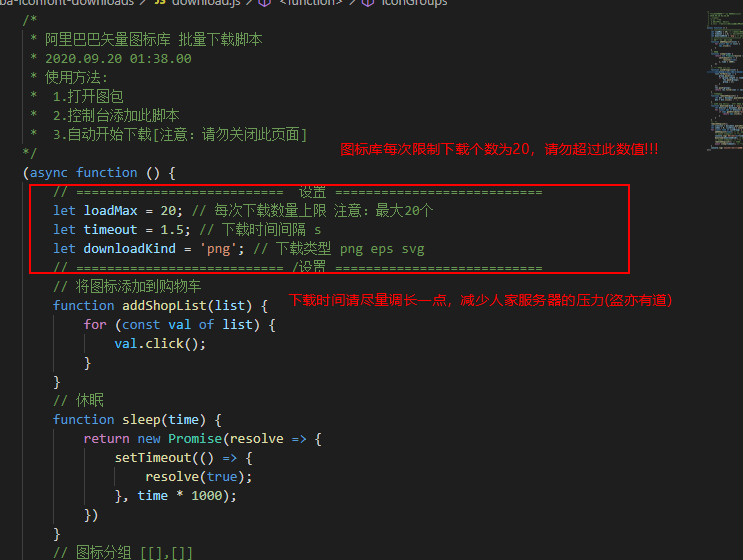

# Alibaba-Iconfont-downloads

**`功能:` 阿里巴巴矢量图标库 `图标库`批量下载脚本**

**`图库地址:` [阿里巴巴矢量图标库](https://www.iconfont.cn/)**

## 使用方法

+ 进入图标库界面
    + 
    + 
+ 按 [F12]进入控制台，复制[脚本](./download.js)全文至控制台(console) 然后按下回车即可
    + 

+ 自动开始下载 `注意`：请勿关闭此页面,否则会停止下载!!!!
+ 下载结果
    + 

## 修改设置

+ 每个小包个数
+ 每个小包时间间隔
+ 下载类型

如图:
