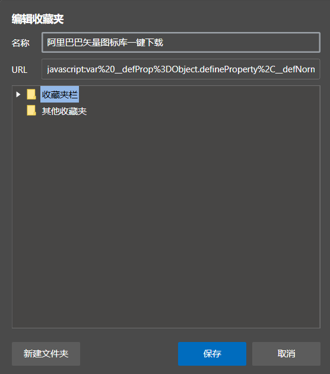
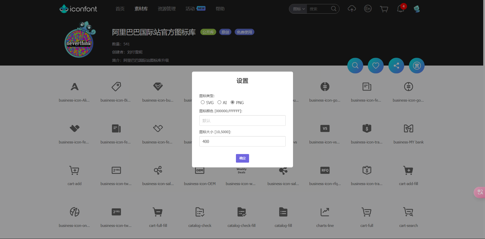
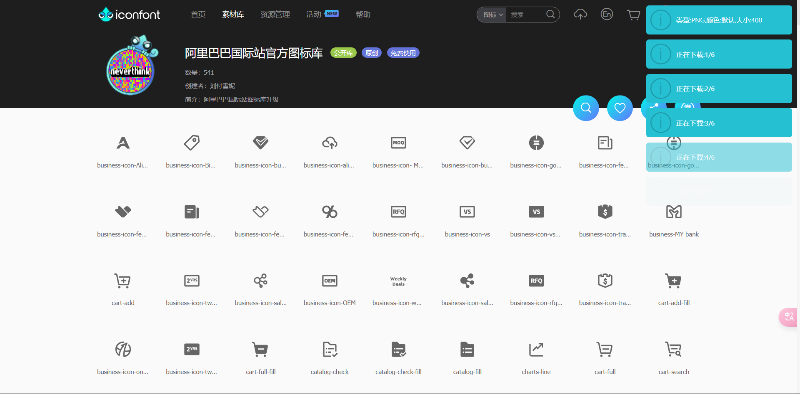
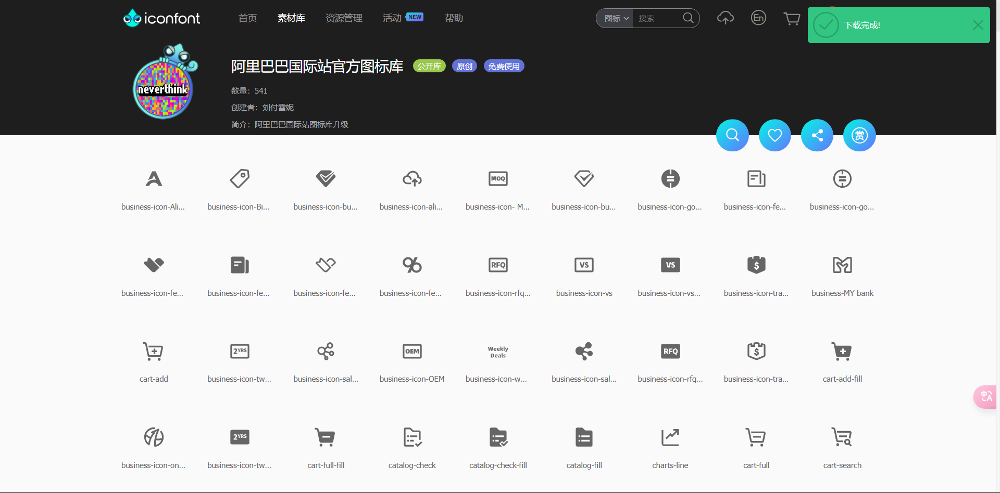
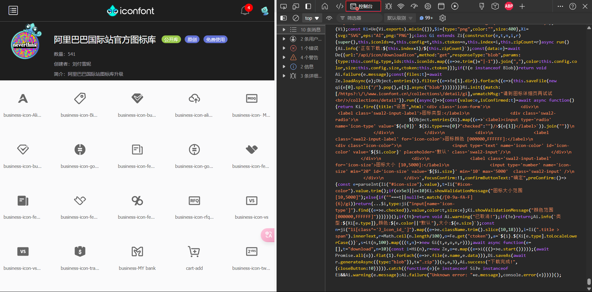

# Alibaba-Iconfont-downloads

阿里巴巴矢量图标库-图标一键下载(Bookmarklet)

> [!WARNING]
> 使用时请先保持登录状态，否则可能下载失败。

## 📖 使用方法

以下两种方式任选其一即可

### 🔖 1. Bookmarklet `推荐`

> [!TIP]
> 网址栏输添加 Bookmarklet 代码时请删除顶部的注释，确保以 javascript: 开头。

随意创建一个书签，名称任取，最后将 [Bookmarklet](dist/bookmark.txt)（./dist/bookmark.txt） 代码粘贴到网址栏，然后点击保存，最后在图标库详情页面点击标签即可。

#### 使用

打开图标库详情页，点击书签，即可下载图标。

##### 下载设置

##### 下载进度

##### 下载完成

### 🏃2. F12 Console

打开图标库详情页，F12 打开控制台, 将 [Console](./dist/console.js)（dist/console.js） 代码粘贴并执行即可。

#### 使用

##### 详情页 F12 打开控制台，将 [Console](./dist/console.js)（dist/console.js） 代码粘贴并执行

> [!TIP]
> 后续步骤与 Bookmarklet 相同：下载设置、下载进度、下载完成。

## 🔥 其他

项目源码请移步至 [bookmark-script](https://github.com/xiaohuohumax/bookmark-script)